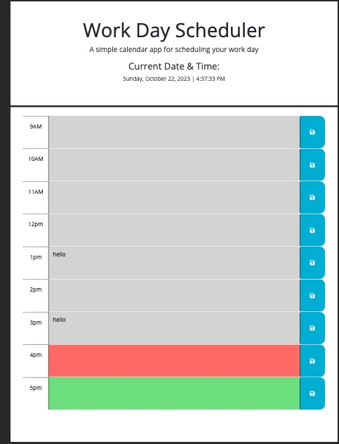

# Description

This web page is a live workday scheduler which shows current time and date. Not only does this scheduler present current time, it will change the color of the time block every hour; past will be shown in gray, present in red, and future in green. Items entered into the text area will be shown until page refresh. Items in the text area which are saved before refresh will be saved locally and will remain on the webpage and hour they are saved to after refresh.  

## Code in index.HTML

Code to index.html is relatively simple, laying out divs for the the header of the page, a live date and time within the header. Following, there is a container with 9 sections within to create the time shown to the left of the webpage, the text input area in the center, and the save button to the right. 

## Code in script.js

Code to script.js contains functions using dayjs, and jQuery in the following: 

<ul>
<li>Used dayjs to set local date and time,</li>
<li>Added dayjs function for live date and time to show on screen within the header,</li>
<li>Added jQuery function to save user input to text entry areas to local storage. ONLY text areas with input entered THEN the User clicks the save button before screen refresh will be saved, </li>
<li>Added jQuery function to retrieve values from local storage so THAT upon refresh the saved inputs will remain on screen, </li>
<li>Added jQuery function so that the webpage hourblock areas will change according to live time. The hourblock will be gray for past, red for present, and green for future.</li>

</ul>

## What I learned and/or struggled with

  
I learned that dayjs is simple to understand an neat in comparison to vanilla JavaScript now.getTime. Not only is dayjs simpler to user but the ability to set multiple formats for so many different displays. I thoroughly enjoyed this ability.   Originally, I thought for the hourlyColorChange function in the script.js file I was going to need to use a large if-else conditional to get he color to change as needed. However, finding the .toggleClass() element in jQuery had to be my happiest moment in this application. Not only did I save myself probably 25 lines of code. I ended up with a very neat, clean, and readable section of code for this function.

## Link to live site

<a href="https://raszerot.github.io/work-day-scheduler-live-time/">Work Day Scheduler</a>

## Image of webpage functionality

 

## License

N/A
